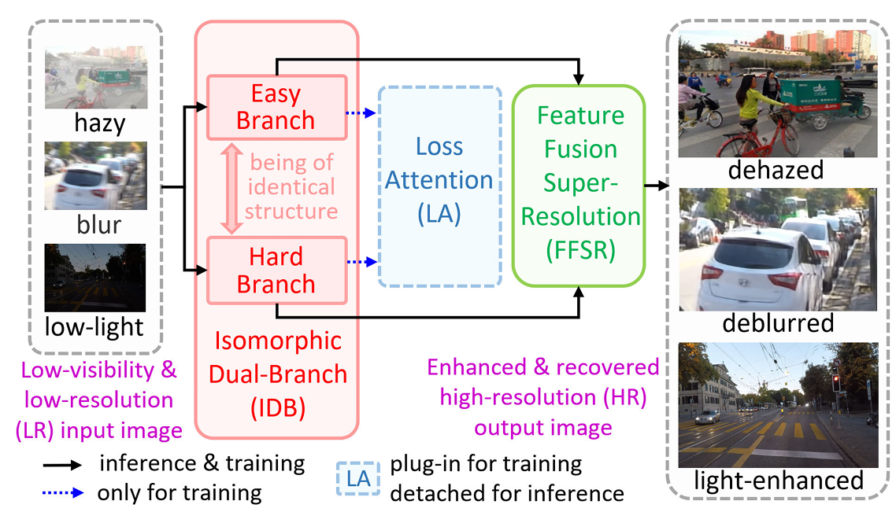

# IDBall Readme

# **Basic Information**

1. This repository contains the official implementation of the following paper: "**Low-Visibility Scene Enhancement by Isomorphic Dual-Branch Framework With Attention Learning**" **Paper Link:** [https://doi.org/10.1007/978-981-99-8073-4_3](https://doi.org/10.1109/TITS.2025.3534472)
2. Authors: Zhan Li; Wenqing Kuang; Bir Bhanu; Yifan Deng; Yihang Chen; Kangkang Xu
3. cite this paper：

```jsx
@ARTICLE{10879350,
  author={Li, Zhan and Kuang, Wenqing and Bhanu, Bir and Deng, Yifan and Chen, Yihang and Xu, Kangkang},
  journal={IEEE Transactions on Intelligent Transportation Systems}, 
  title={Low-Visibility Scene Enhancement by Isomorphic Dual-Branch Framework With Attention Learning}, 
  year={2025},
  volume={},
  number={},
  pages={1-15},
  keywords={Transformers;Image enhancement;Visual perception;Superresolution;Image reconstruction;Degradation;Electronic mail;Transportation;Training;Strips;Deep learning;image enhancement;intelligent transportation systems;super resolution;visual perception},
  doi={10.1109/TITS.2025.3534472}}

```

# **Abstract**

Vision-based intelligent systems are extensively used in autonomous driving, traffic monitoring, and transportation surveillance due to their high performance, low cost, and ease of installation. However, their effectiveness is often com- promised by adverse conditions such as haze, fog, low light, motion blur, and low resolution, leading to reduced visibil- ity and increased safety risks. Additionally, the prevalence of high-definition imaging in embedded and mobile devices presents challenges related to the conflict between large image sizes and limited computing resources. To address these issues and enhance visual perception for intelligent systems operating under adverse conditions, this study proposes an all-in-one isomorphic dual-branch (IDB) framework consisting of two branches with identical structures for different functions, a loss-attention (LA) learning strategy, and feature fusion super-resolution (FFSR) module. The versatile IDB network employs a simple and effective encoder-decoder structure as the backbone for both branches, which can be replaced with task-specific tailored backbones. The plug-in LA strategy differentiates the functions of the two branches, adapting them to various tasks without increasing computational demands during inference. The FFSR module concatenates multi-scale features and restores details progressively in downsampled images, producing outputs with improved visibility, brightness, edge sharpness, and color fidelity. Extensive experimental results demonstrate that the proposed framework outperforms several state-of-the-art methods for image dehazing, low-light enhancement, image deblurring, and super-resolution image reconstruction while maintaining low computational overhead. The associated code is publicly available at [https://github.com/lizhangray/IDBall](https://github.com/lizhangray/IDBall).

# **Overview**



Fig: The IDB framework for low-visibility enhancement of scenes in adverse conditions such as haze, low light, blur, and low resolution.

Our main contributions are summarized as follows.

- A versatile and flexible IDB framework is designed for low-visibility enhancement of diverse images acquired under adverse conditions, including haze, low lightness, blur, and low resolution. The IDB network can process various degraded images to improve visual perception for downstream high-level computer vision tasks.
- A loss attention (LA) learning strategy is proposed for both the pixel and patch levels to distinguish image parts that are “easy” or “hard” to learn. A dynamic mask is automatically computed to differentiate the roles of the two isomorphic branches during the training phase of the IDB network. Additionally, the LA module is detached at inference time to maintain efficiency.
- An SR module for progressive multi-scale feature fusion (PMFFSR) is designed to restore the details in low-visibility LR images. Consequently, large input images are downsampled and then enhanced or recovered with a low computational cost.

# **Environment**

1. Clone Repo
    
    ```
    git clone <code_link>
    cd IDBall-main/
    ```
    
2. Create Conda Environment and Install Dependencies
    
    ```jsx
    torch
    tqdm
    piqa
    ...
    ```
    

# **Prepare models and quick test**

1. Prepare your directory structure
    
    ```
    IDBall-main
        |- datasets
            |- ACDC_night
                |- test_gt
                |- test_low
            |- GoPro
                |- test
                    |- GOPR0384_11_00
                        |- blur
                        |- blur_gamma
                        |- sharp
                    ...
            |- SOTS
                |- outdoor
                    |- gt
                    |- hazy          
        |- model
            |- ACDC_night-025.pth
            |- ACDC_night-05.pth
            |- GoPro-025.pth
            |- OTS-025.pth
            |- OTS-05.pth
        |- weights
            |- res2net101_v1b_26w_4s-0812c246.pth
    ```
    
2. Download Test Set and Models
    1. Test Set：
        
        ACDC_night: [click here to download](https://drive.google.com/file/d/16oygfc3kg7ZpTfaEY74Wrpgx6_k-45HF/view?usp=sharing)
        
        GoPro: [click here to download](https://seungjunnah.github.io/Datasets/gopro.html)
        
        SOTS: [click here to download](https://sites.google.com/view/reside-dehaze-datasets/reside-v0?authuser=0)
        
    2. Models：[click here to download](https://drive.google.com/drive/folders/1iPeD7KxFmG_148YHY9YqwOF7lFzVqnza?usp=sharing)
    
    3. Res2Net weight：[click here to download](https://drive.google.com/drive/folders/1N2Fl5b7t20p3OuG1D9zn8qfdjaeHhcA3?usp=sharing)
    
3. Run eval
    
    ```
    python3 test.py Dehaze-OTS-05
    ```
    
    There are four parameters that must be provided:
    
    - `Dehaze-OTS-05`: Indicates performing the **dehazing** task, the model was trained on the **OTS** dataset, and the input images are **2x downsampled** images.
    - `Dehaze-OTS-025`: Indicates performing the **dehazing** task, the model was trained on the **OTS** dataset, and the input images are **4x downsampled** images.
    - `Delowlight-ACDC_night-05`: Indicates performing the **low-light enhancement** task, the model was trained on the **ACDC_night** dataset, and the input images are **2x downsampled** images.
    - `Delowlight-ACDC_night-025`: Indicates performing the **low-light enhancement** task, the model was trained on the **ACDC_night** dataset, and the input images are 4**x downsampled** images.
    - `Deblur-GoPro-025`: Indicates performing the **deblurring** task, the model was trained on the **GoPro** dataset, and the input images are **4x downsampled** images.
    
4. The results are saved in the "output" folder.